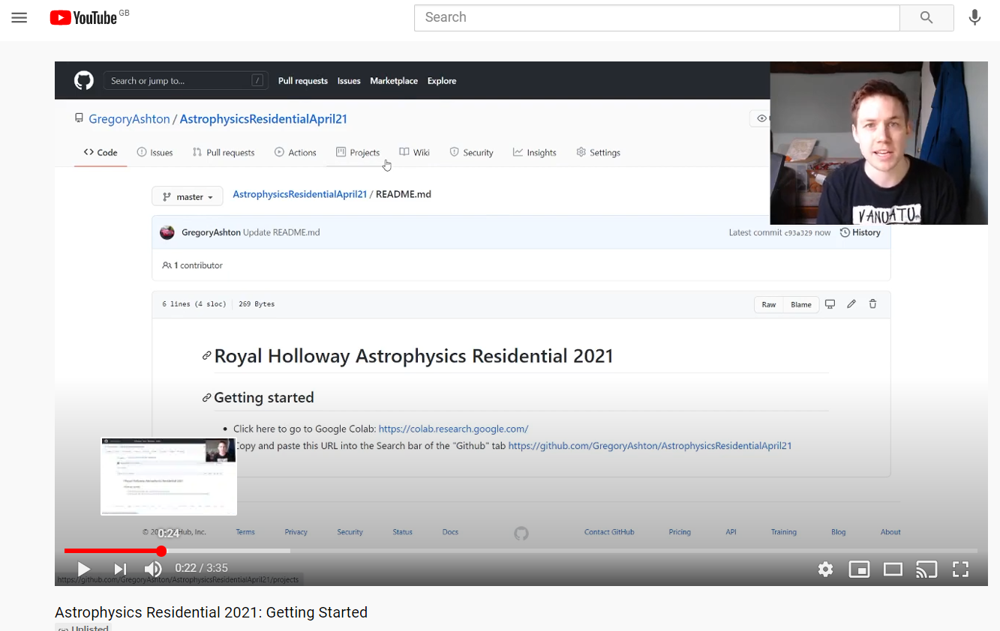

# Royal Holloway Astrophysics Residential 2021

Hello and welcome to the Astrophysics Residential Programming page! Click the image below if you'd like to watch a video introduction, or skip straight to "getting started" below.

## Getting started

* **Step 1**: Click here to go to Google Colab: https://colab.research.google.com/
* **Step 2**: Copy and paste this URL into the Search bar of the "Github" tab https://github.com/GregoryAshton/AstrophysicsResidentialApril21
* **Step 3**: Select which notebook you want to run
  - `Getting_started.ipynb`: start with this notebook to learn the basics of Python
  - `Estimating_pi_with_random_numbers.ipynb`: Then open this notebook where we estimate pi with random numbers!
